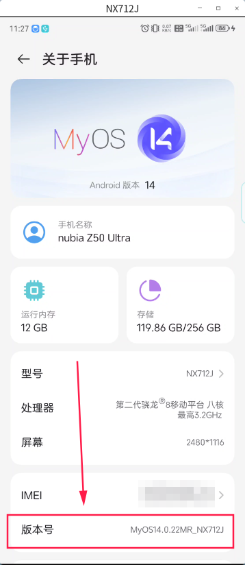
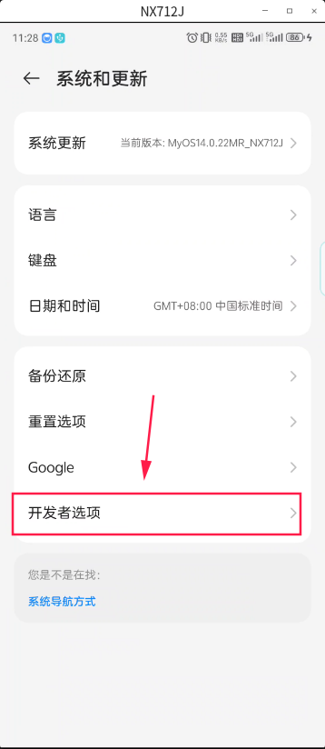
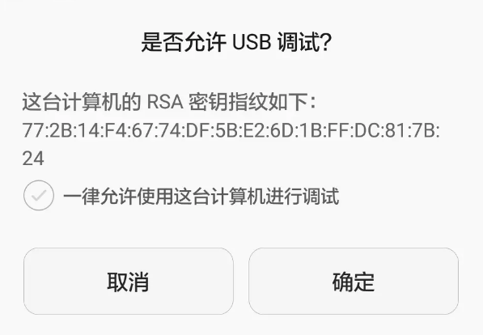

## 一、准备

首先需要 `adb (Android Debug Bridge)` 工具包，如果电脑有安装 Android SDK，`adb` 工具在 `platform-tools` 目录下，需要将 `platform-tools` 目录添加到 `PATH` 环境变量中即可。

如果电脑上没有安装过 Android SDK，可以到官网下载对应操作系统的独立 `platform-tools` 工具包即可，下载到本机之后解压到本机任意目录下，然后将解压后的目录添加到 `PATH` 环境变量中即可。

> `platform-tools` 工具包下载网页地址: <https://developer.android.google.cn/tools/releases/platform-tools?hl=zh-cn#downloads>

## 二、准备手机

准备一台Android手机，进入手机，进入 `设置` -> `关于手机` -> 不断点击`版本号`，直到提示“成功打开开发者模式”，如下图



此时系统中正常显示出开发者菜单，如下图



再进入开发者选项，打开 `USB debugging` 选项，如下图


最后，用数据线将手机链接到电脑上，使用 `adb shell` 命令进入 Android Shell 环境，如果没有正常进入 Shell 环境，可以使用 `adb devices` 命令查看是否连接成功。

在以上操作过程中，如果电脑是第一次使用 `adb` 连接手机，电脑上会弹出一个提示框，选择 `允许`，即可完成设置，如下图：



## 三、使用 adb 实现点击屏幕功能

我们可以使用 `adb shell input tap X Y` 命令实现点击屏幕的功能，其中 `X` 和 `Y` 分别为点击屏幕的坐标。我们需要提前预判出点击屏幕的坐标，例如在分辨率为 1080x1920 的手机上，点击屏幕的中心点，坐标为 `540 960`，则可以使用 `adb shell input tap 540 960` 命令实现点击屏幕的功能。

假设我们要点连续点击屏幕的中心点，可以把点击命令封装成脚本，如下：

```shell
#!/bin/bash
while true; do
    count=$((count+1))
    echo "第 $count 次点击"
    adb shell input tap 540 960
    sleep 3
done
```

以上脚本中，`while true` 表示一直循环，`count=$((count+1))` 表示每次循环时，`count` 值加 1，`echo "第 $count 次点击"` 表示每次点击屏幕时，打印出点击次数，`adb shell input tap 540 960` 表示点击屏幕的中心点，`sleep 3` 表示每次点击后，等待 3 秒，然后继续点击屏幕的中心点。

> 注意：以上脚本适用于Linux和MacOS的Shell环境。
