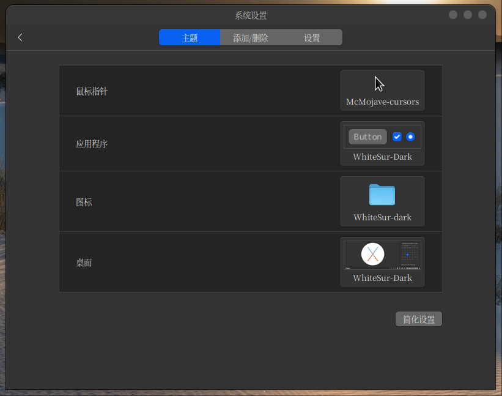
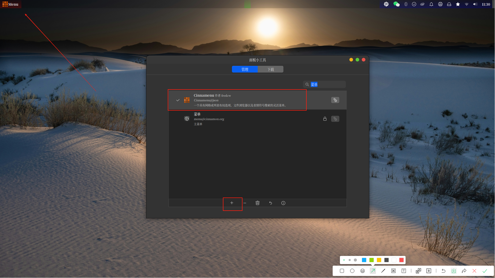
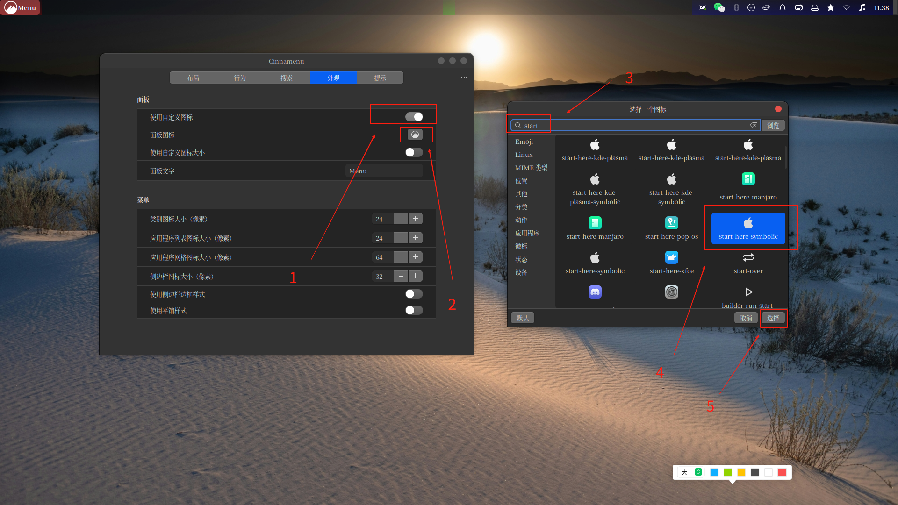
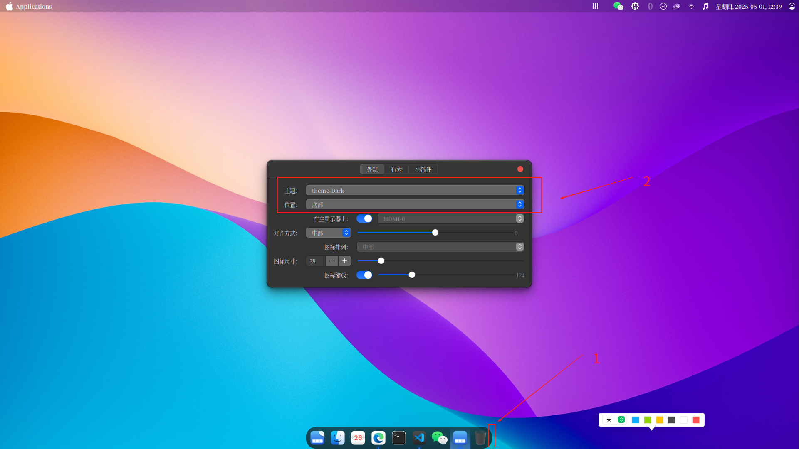

## 一、概述

本教程也适用于使用Cinnamon桌面的Linux发行版，例如Linux Mint、Feren OS、带有Cinnamon的OpenSUSE、Debian Cinnamon版本、Fedora Cinnamon版本、带有Cinnamon桌面的Arch以及Manjaro Cinnamon版。

## 二、实现过程

### 2.1 下载壁纸

通过<https://www.pling.com/p/1400125>这个链接下载壁纸。后续我们可以将这些macOS里的壁纸设置成我们电脑的壁纸。

### 2.2  安装 Gtk 主题 - Whitesur Gtk Theme Light/Dark

先安装基础工具包

```bash
sudo apt install sassc optipng inkscape libcanberra-gtk-module libglib2.0-dev libxml2-utils git
```

拉取代码，安装主题包

```bash
cd ~/Downloads
git clone https://github.com/vinceliuice/WhiteSur-gtk-theme.git
cd WhiteSur-gtk-theme/
./install.sh
```

### 2.3 安装图标主题 - Whitesur Icon Theme Light/Dark

```bash
cd ~/Downloads
git clone https://github.com/vinceliuice/WhiteSur-icon-theme.git
cd WhiteSur-icon-theme/
./install.sh
```

### 2.4 安装鼠标主题 - McMojave Cursors

```bash
cd ~/Downloads
git clone https://github.com/vinceliuice/McMojave-cursors.git
```

### 2.5 设置主题

打开到cinnamon的主题设置窗口：系统设置->主题，选择我们上述步骤安装好的主题，如下截图



### 2.6 配置面板和面板小工具

#### 2.6.1 移除默认面板小工具

- 移动面板：鼠标悬浮到桌面底部程序面板上 -> 选择右键菜单 -> 选择移动 -> 将面板移动到顶部

- 移除分组窗口列表和菜单：点击右键 -> 打开面板编辑模式

（1）将鼠标悬浮在正在打开的应用图标上 -> 移除分组窗口列表
（2）将鼠标悬浮到菜单上 -> 移除菜单
（3）将鼠标悬浮到分割符上 ->  移除分隔符

### 2.6.2 配置启动菜单

- 将鼠标悬浮到面板上，右键打开面板小工具：选择到“下载”选项卡，下载“cinnamonmenu”工具，安装成功后，添加到面板上，如下图



- 将鼠标悬浮到刚才增加的菜单上 -> 右键打开配置面板 -> 切换到菜单外观选项卡 -> 勾选“自定义图标”，根据如下图提示，选择对应的启动图标



- 我们将菜单的面板文字“Menu”修改为“Applications”

- 再切换到布局 -> 侧边栏位置 -> 将底部修改为顶部 -> 最后关闭面板编辑模式

### 2.6.3 配置其他面板菜单

- 通过菜单打开面板小工具应用 -> 在管理切换卡搜索“scale” -> 选中“缩放”之后点击添加

- 在管理切换卡搜索“user” -> 选中“用户面板小工具”之后点击添加 -> 再右键点击面板 -> 勾选面板编辑模式 -> 将“用户面板小工具”推动到最右侧 -> 最后关闭面板编辑模式

- 现在我们还可以选择编辑小面板中“日历”面板的格式，可以选择这样的格式 `%A, %Y-%m-%d, %H:%M`

## 2.7 安装和配置Plank Dock

执行以下命令安装

```bash
sudo apt install plank
```

现在通过菜单打开plank，再使用以下命令将上述下载的主题附带的plank的主题拷贝到plank的主题配置文件夹

```bash
cp -r ~/Downloads/WhiteSur-gtk-theme/src/other/plank/* ~/.local/share/plank/themes/
```

现在需要将鼠标悬浮到plank面板之上，修改主题为`theme-dark`，其他配置可以根据个人喜好选择，如下图



最后，打开“开启自启程序”应用，设置`plank`为开机自启。

## 三、总结

经过以上操作步骤，当前桌面已经有macOS的基础外观了，如果还想进一步优化，可以参根据个人需求进行细微调整。
